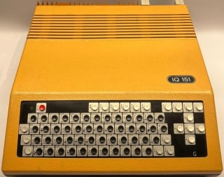

IQ 151 emulator using FabGL
===========================

The great FabGL library created by Fabrizio Di Vittorio delivers above all graphics library for ESP32 in conjunction with a VGA monitor. In addition to its own library, on the basis of which you can build your own project, it also contains a number of examples for library usage. Among them are emulators of old 8-bit computers from the era about 40 years ago. E.g. here you will find computers Altair 8800, Commodore VIC-20 and even a 16-bit IBM XT computer with a number of optional operating systems.

In the 80s in Czechoslovakia, the IQ 151 computer reigned supreme in schools. Its low reliability became a nightmare for many teachers and students. If you would like to reminisce about this computer and enjoy looking at its specific font, here is one option. Information about the IQ151 computer can be found, for example, at https://en.wikipedia.org/wiki/IQ_151 . The power of the FabGL library makes it quite easy to create an emulator of such a computer on a VGA screen.

Requirements for IQ151 Emulator
-------------------------------

*   On the HW side the ESP32 WROVER module must be connected according to the diagram on the website http://www.fabglib.org . A VGA monitor and a PS2 keyboard need to be connected to the module.
*   Install the Arduino IDE (tested with version 1.8.13 up to 1.8.19) with ESP32 support. The Arduino IDE must be supplemented with the FabGL library.
*   Place the folder that contains four source files in the folder, where Arduino saves projects on your computer.
*   After opening the project, you should be able to load the program into the ESP32 memory (instructions are on the website). The settings are the same as for the other computers in the examples FabGL shown in video tutorials.
*   A microSD card is not required for the function.

The principle of the emulator program
-------------------------------------

The program mainly uses FabGL library classes for work. The graphical interface of the application consists of the drawScanline function, which prepares individual points for display on a VGA monitor and creates a VIDEO 32 card. Pressing a key on the connected PS2 keyboard is processed in the functions processKeyDown and processKeyUp. The actual emulation of the 8080 processor is done by an instance of the i8080 class.

This will allow you to work in monitor mode or switch to BASIC 6:

With this computer, I don't expect anyone to want to create programs for it anymore. The "cassette recorder" is therefore not connected to the computer :-)

Using an emulator
-----------------

The program can be controlled via a connected PS2 keyboard. The keys are transformed to the original keyboard according to the following image.

Conclusion
----------

In the FabGL library users gained a powerful tool for creating not only their own projects, but in the examples of emulated computers also a lot of older software created for completely different devices many years ago.

References
----------

http://www.fabglib.org  
https://github.com/fdivitto/FabGL  

* * *

Emulátor IQ 151 pomocí FabGL
============================

Skvělá FabGL knihovna, kterou vytvořil Fabrizio Di Vittorio, přináší především grafickou knihovnu pro ESP32 ve spojení s VGA monitorem. Kromě vlastní knihovny, na jejímž základě můžete postavit vlastní projekt, obsahuje i řadu příkladů pro použití knihovny. Mezi nimi jsou i emulátory starých 8bitových počítačů z doby před asi 40 lety. Např. zde najdete počítače Altair 8800, Commodore VIC-20 a dokonce i 16bitový počítač IBM XT s řadou volitelných operačních systémů.

V 80-tých letech v Československu ve školách kraloval počítač IQ 151. Jeho malá spolehlivost se stala noční můrou mnoha učitelů a žáků. Pokud byste na tento počítač chtěli zavzpomínat a pokochat se pohledem na jeho specifický font, zde máte jednu z možností. Informace o počítači IQ151 najdete např. na https://en.wikipedia.org/wiki/IQ_151 . Výkon knihovny FabGL umožňuje poměrně snadno vytvořit emulátor takového počítače na VGA obrazovce.

Požadavky pro emulátor IQ151
----------------------------

*   Po HW stránce musí být modul ESP32 WROVER zapojený podle schéma na stránkách http://www.fabglib.org . K modulu je potřeba připojit VGA monitor a PS2 klávesnici.
*   Na osobním počítači musí být instalováno Arduino IDE (testováno s verzí 1.8.13 až 1.8.19) s podporou ESP32. Arduino IDE se doplní o knihovnu FabGL.
*   Obsah složky, která obsahuje 4 zdrojové soubory umístěte do složky, kam Arduino ukládá na vašem počítači projekty.
*   Po otevření projektu byste měli být schopni nahrát program do paměti ESP32 (návody jsou na webu). Nastavení je stejné jako u dalších počítačů v příkladech FabGL ukázaných ve video návodech.
*   Pro funkci není potřeba mikroSD karta.

Princip programu emulátoru
--------------------------

Program využívá pro práci především třídy knihovny FabGL. Grafické rozhraní aplikace je tvořeno funkcí drawScanline, která připravuje jednotlivé body pro zobrazení na VGA monitoru a vytváří kartu VIDEO 32. Zmáčknutí klávesy na připojené klávesnici PS2 je zpracováno ve funkcích procesKeyDown a procesKeyUp. Vlastní emulaci procesoru 8080 provádí instance třídy i8080.

Umožní vám to práci v monitorovém režimu nebo přepnutí do BASIC 6:

U tohoto počítače nepředpokládám, že by pro něj někdo chtěl ještě tvořit programy. "Kazetový magnetofon" není proto k počítači připojen :-)

Použití emulátoru
-----------------

Program je možné ovládat přes připojenou klávesnici PS2. Klávesy jsou transformovány na původní klávesnici podle následujícího obrázku.

Závěr
-----

V knihovně FabGL získali její uživatelé mocný nástroj na tvorbu nejen vlastních projektů, ale jak ukazují příklady emulovaných počítačů i na využití staršího software vytvořeného pro úplně jiná zařízení před mnoha lety.

Použitá literatura
------------------

http://www.fabglib.org  
https://github.com/fdivitto/FabGL  

* * *
